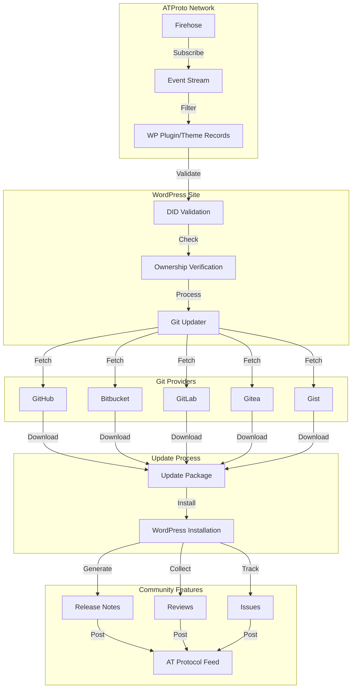

# WordPress Plugins and Themes in the ATmosphere

> Based upon a discussion I had with Claude 3.5 Sonnet.

This would allow developers to publish their work on a decentralized platform and provide users with a more secure and reliable way to manage their installations.

## Idea

- use the [atproto](https://atproto.com/) protocol to discover ([firehose](https://atproto.com/specs/sync#firehose)) [plugins and themes](https://atproto.com/guides/data-repos) and validate ownership (under a users profile?)
- use git-updater ([afragen/git-updater](https://github.com/afragen/git-updater)) and its api plugins to retrive plugins from:

  - GitHub
  - Bitbucket
  - GitLab
  - Gitea
  - Gist
  - ... and more

### Additional Considerations

- Security verification through AT Protocol's DID system
- Version tracking and compatibility checks
- Release notes and changelogs as posts/threads
- Community engagement through likes/replies
- Plugin/theme ratings and reviews as posts
- Automated testing results publishing
- Dependency tracking and notifications
- Support ticket integration
- Documentation hosting
- monetization options through App Passwords
- Plugin/theme collections as lists
- Cross-promotion between developers
- Issue tracking integration

### Plan

1. Create WordPress plugin framework
2. Implement ATProto connection
3. Set up firehose subscription
4. Add plugin/theme validation
5. Integrate with git-updater
6. Create repository handlers

Key features:

- Connects to ATProto network
- Subscribes to firehose for plugin/theme records
- Validates ownership through DIDs
- Integrates with multiple git providers
- Hooks into git-updater system
- Provides admin interface for configuration

Implementation Challenges:

- Rate limiting and data caching
- Network resilience
- Backwards compatibility
- Migration path for existing plugins
- Handling private repositories
- Multi-network synchronization
- Version conflict resolution
- Data backup and recovery
- GDPR compliance
- License management

Standards to Consider:

- WordPress Coding Standards
- ATProto Lexicon Schema
- Semantic Versioning
- Security best practices
- i18n/l10n requirements
- Accessibility guidelines

Next steps would be:

1. Define custom lexicon for wp plugins/themes
2. Implement repository provider classes
3. Create admin interface
4. Add update checker integration
5. Build discovery feed UI

## Process Flow

